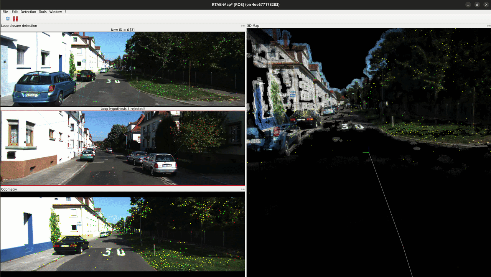
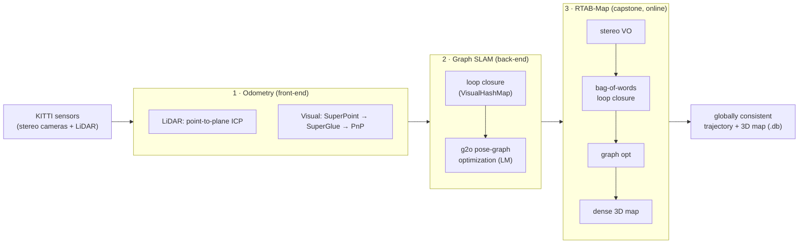

# Ultimate SLAM

> From raw KITTI sensor streams to a globally consistent 3D map: classical SLAM built by hand, then capped with production-grade RTAB-Map.

---

## Overview

A ground-up **Simultaneous Localization and Mapping (SLAM)** project built in three stages on the
[KITTI](https://www.cvlibs.net/datasets/kitti/) autonomous-driving dataset. Each stage implements one
classical piece of a SLAM system: front-end odometry, then a graph-optimization back-end and the final stage runs the industrial **RTAB-Map** library to do the entire stack online at once.

Significance: Every autonomous system faces the same problem: to know where it is, it needs a map and to build a map, it needs to know where it is. SLAM (Simultaneous Localization and Mapping) solves both at once, estimating the robot's trajectory while reconstructing the world around it from nothing but onboard sensors. The result is an end-to-end, sensor-to-map pipeline that spans both the fundamentals and the real deployment: classical geometry, modern learned features, graph optimization, and a production SLAM system, all reproducible inside a single Docker image on ROS 2.

---

## Pipeline

The system is composed of three sequential stages:

**1. Front-End Odometry** : `odometry/`
- Estimates relative frame-to-frame motion, two independent ways
- **LiDAR:** point-to-plane ICP on point clouds (Open3D), chained into a dead-reckoned pose
- **Visual:** SuperPoint → SuperGlue → (LiDAR-depth) → PnP for camera pose
- No loop closure - drift accumulates by design, motivating Stage 2

**2. Graph-SLAM Back-End** : `mapping/`
- Fuses camera + LiDAR observations into landmarks
- Detects loop closures with a spatial-grid landmark store (**VisualHashMap**)
- Optimizes a g2o pose graph with Levenberg–Marquardt → globally consistent trajectory

**3. RTAB-Map Capstone** : `rtabmap/`
- Feeds KITTI stereo to the production **RTAB-Map** SLAM system
- Performs stereo visual odometry, **appearance-based loop closure** (bag-of-words),
  pose-graph optimization, and dense 3D mapping online and together
- The production version of everything hand-built in Stages 1-2

---

## Key Results

| Stage | Technique | Loop closure | Output |
|---|---|:---:|---|
| 1a · LiDAR odometry | Point-to-plane ICP (Open3D) | ✗ | Dead-reckoned pose (drifts) |
| 1b · Visual odometry | SuperPoint + SuperGlue + PnP | ✗ | Camera pose (drifts) |
| 2 · Graph SLAM | VisualHashMap + g2o (Levenberg–Marquardt) | ✓ | Globally consistent trajectory |
| 3 · RTAB-Map | Stereo VO + bag-of-words + graph optimization | ✓ | Online dense 3D map (`.db`) |

<!-- Drag your RTAB-Map screenshots into the GitHub web editor here to embed them: -->
<!--  -->
<!--  -->

---

## Tech Stack

**SLAM:** Point-to-plane ICP · SuperPoint + SuperGlue · PnP / RANSAC · g2o pose-graph optimization · Bag-of-words loop closure · RTAB-Map

**Point clouds / vision:** Open3D · OpenCV · PyTorch (SuperPoint/SuperGlue, LightGlue)

**Middleware:** ROS 2 Humble · `tf2` · `message_filters` · rosbag2 (sqlite3)

**Dataset:** KITTI (sequence `2011_10_03`)

**Visualization:** RViz2 · Plotly

---

## Author

**Aryaman Mahajan**

